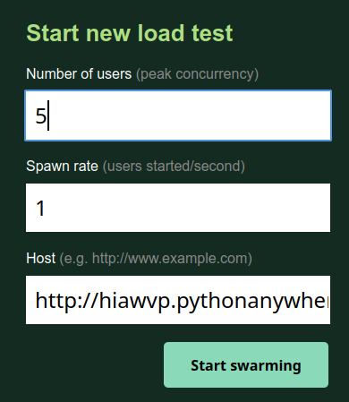

# tent

### Repositorio (branch backend) que contiene el servidor Flask del proyecto Gestión Botillería. Desarrollado para la asignatura Taller Ingeniería de software INFO282, Universidad Austral de Chile.

Tiene también el Jenkinsfile y archivos de configuración para CI/CD

## Repositorios relacionados:

* Github documentación https://github.com/matiasbarram/info282

* Github implementación https://github.com/matiasbarram/info282-implementacion

## Actualmente desplegada en pythonanywhere

https://hiawvp.pythonanywhere.com/

# Instalación y config

### se recomienda usar linux + conda 

# Para ejecutar los tests no es necesario instalar y configurar la base de datos, ya que se pueden hacer sobre la version en pythonanywhere tras instalar las dependencias python

<--- opcional
### Para replicar el ambiente de desarrollo localmente se necesita una instalación de mysql / mariadb y

```
$ mysql --version
> mysql  Ver 8.0.28-0ubuntu0.20.04.3 for Linux on x86_64 ((Ubuntu))
```

- Crear la base de datos y cargar la informacion desde el archivo `taller.sql`

```
$ mysql -u root -p -e "create database taller;"
$ mysql -u root -p taller < taller.sql

  Los ambientes de desarrollo y testing por defecto utilizan el user:pass de mysql `root:root`. Esto es configurable en el Connection URL `DB_URL` en los archivos .cfg de la carpeta `instance`)
```
---> opcional


- clonar repo y seleccionar la brach `backend`

```
$ git clone git@github.com:matiasbarram/INFO282-Implementacion.git
$ cd INFO282-Implementacion/
$ git checkout backend
```

- Instalar dependencias

```bash
$ conda create --name tent pip
$ conda activate tent
$ pip install -r requirements.txt
```


```
$ export FLASK_APP=main.py
$ export FLASK_ENV=development
$ flask run
```

- si aparece el error `Error: While importing 'main', an ImportError was raised.`  recargar el ambiente

```
$ conda deactivate && conda activate tent
```

# Ejecutando los tests

- Pytest

```bash
$ pytest tests -v -W ignore::DeprecationWarning
```

- Locust

```
$ cd tests
$ locust
```
ir a la interfaz grafica que se encuentra en `http://0.0.0.0:8089` 

ingresar los valores:



y en host usar `http://hiawvp.pythonanywhere.com/productos/16` o `http://http://127.0.0.1:5000/productos/16` si es local

- Venta multiple

usar la variable segun el tipo de test que este realizando (local o al servicio desplegado en la web)

```
python
# url = 'http://127.0.0.1:5000/ventas/?nombre=tester'
url = 'https://hiawvp.pythonanywhere.com/ventas/?nombre=tester'
```

desde la carpeta raiz del repositorio

`$ python /tests/venta_multple.py`


# Documentación API

### Login no requerido (deshabilitado temporalmente)

**Ver un Producto**
----
  Retorna la información en JSON de un producto en particular

* **URL**

  /productos/:id

* **Method:**

  `GET`
  
*  **URL Params**

   **Required:**
 
   `id=[integer]`

* **Data Params**

  None

* **Success Response:**

  * **Code:** 200 <br />
  * **Content:** 

```
idProducto : Integer
nombre : String
descripcion : String
stock : Integer
categoria : String
formato : String
codigoBarra : String
cantidadRiesgo : Integer
precioVenta : Integer
precioUnitario : Integer
valorItem : Integer

```
 
* **Error Response:**

  * **Code:** 404 NOT FOUND <br />
    **Content:** `{ error : "no se encontro producto" }`

  OR

* **Error Response:**

  * **Code:** 401 UNAUTHORIZED <br />
    **Content:** `{ error : "Login required" }`


* **Sample Call:**
 
  ```shell
  curl --location --request GET 'http:(ip):(port)/productos/'
  ```


**Ver Productos**
----
  Retorna un JSON con
  - items: array de 10 Producto
  - rowsNumber: cantidad total de productos que satisfacen los criterios de busqueda (para efectos de paginacion)
  
* **URL**

  /productos/

* **Method:**

  `GET`
  
*  **URL Params**

    **Optional:**

    ```page=[integer]```

    ```perpage=[integer]```

    ```filter=[string]```

    ```sortby=[string]```

    ```order=[string]```

* **Success Response:**

  * **Code:** 200 <br />
  * **Content:**
    
```json    	
"items": 
  [
  {"formato":"botella","codigoBarra":"1234342", ..., "idProducto":90},
  ...,
  {"formato":null,"codigoBarra":null,..., "idProducto":120}
  ],
 "rowsNumber": 18
 ```
* **Error Response:**

  * **Code:** 401 UNAUTHORIZED <br />
    **Content:** `{ error : "Login required" }`

* **Sample Call:**

  ```shell
  curl --location --request GET 'http://127.0.0.1:5000/productos/'
  ```
  
    ```shell
  curl --location --request GET 'https://hiawvp.pythonanywhere.com/productos/'
  ```
    
    

